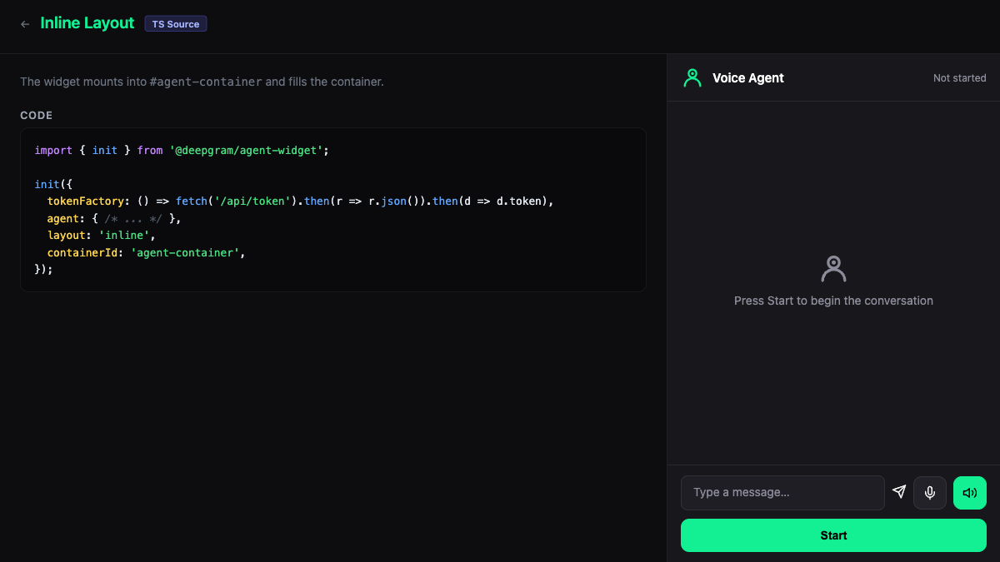

# Inline — Widget

Agent panel mounted inline in a host container. Uses `@deepgram/agents-widget` with `layout: 'inline'`.

**Package:** `@deepgram/agents-widget`



## Run

```bash
# From the repo root
bun run dev:examples
# Open http://localhost:5173/02-widget-inline/
```
