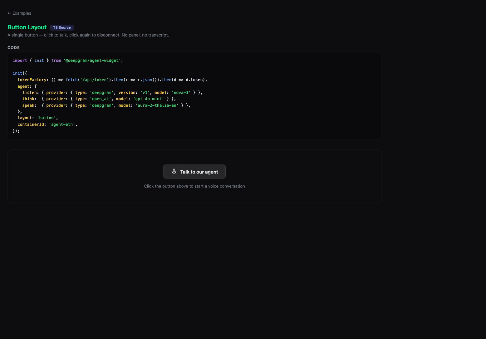

# Button — Widget

Single button — click to talk, click to stop. Uses `@deepgram/agent-widget` with `layout: 'button'`.

**Package:** `@deepgram/agent-widget`



## Run

```bash
# From the repo root
bun run dev:examples
# Open http://localhost:5173/04-widget-button/
```
