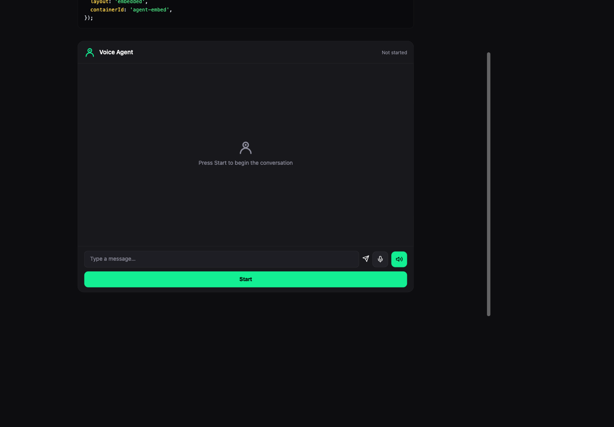

# Embedded — Widget

Fills container width with full chat UI. Uses `@deepgram/agent-widget` with `layout: 'embedded'`.

**Package:** `@deepgram/agent-widget`



## Run

```bash
# From the repo root
bun run dev:examples
# Open http://localhost:5173/05-widget-embedded/
```
