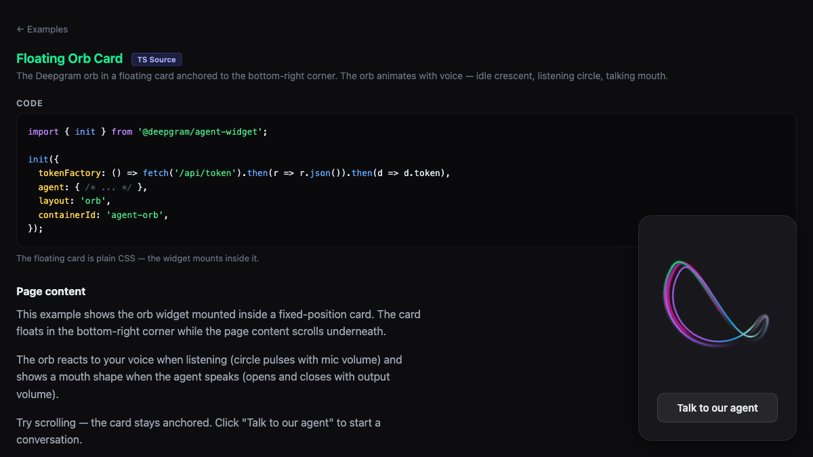

# Floating Orb — Widget

Orb widget in a floating card anchored to the bottom-right corner. Uses `@deepgram/agents-widget` with `layout: 'orb'`.

**Package:** `@deepgram/agents-widget`



## Run

```bash
# From the repo root
bun run dev:examples
# Open http://localhost:5173/07-widget-floating-orb/
```
