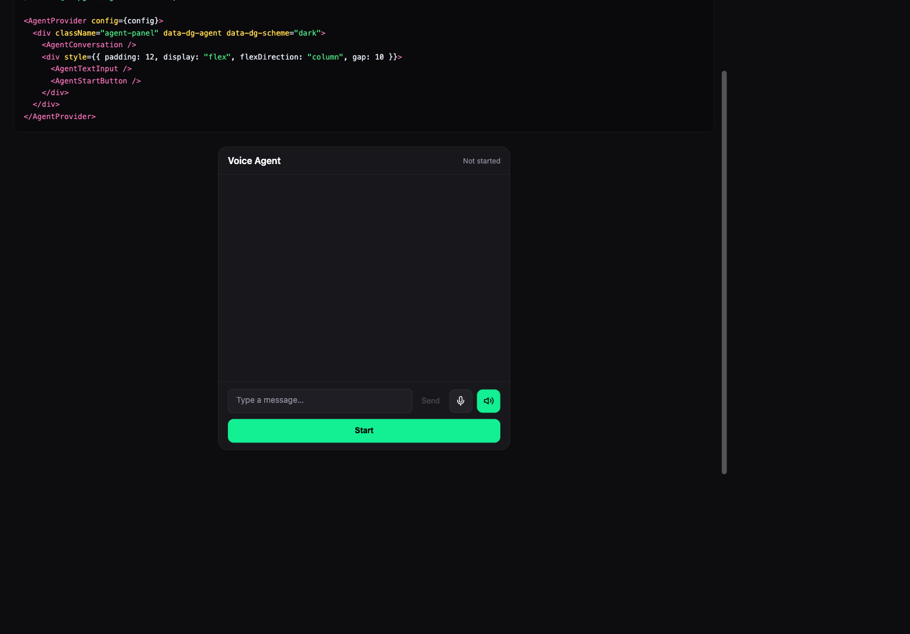

# Inline — React

Inline panel built with `@deepgram/ui` components. You provide the sized container, components style themselves.

**Package:** `@deepgram/ui`



## Run

```bash
# From the repo root
bun run dev:examples
# Open http://localhost:5173/11-react-inline/
```
