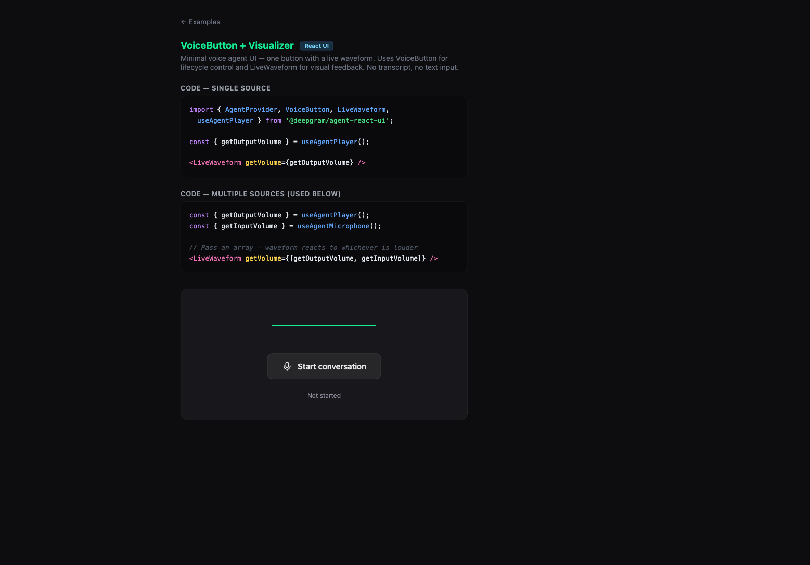

# VoiceButton + Waveform — React UI

Minimal voice UI — VoiceButton for lifecycle control and LiveWaveform for visual feedback. No transcript.

**Package:** `@deepgram/agent-react-ui`



## Run

```bash
# From the repo root
bun run dev:examples
# Open http://localhost:5173/14-react-ui-voice-button/
```
