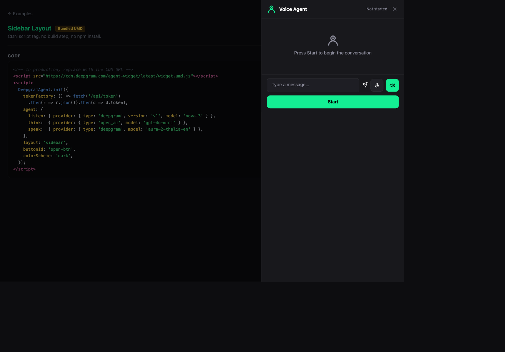

# Sidebar — Bundled UMD

CDN script tag, no build step, no npm install. Uses `DeepgramAgent.init()` with `layout: 'sidebar'`.

**Package:** `@deepgram/agent-widget` (UMD bundle)



## Run

```bash
# From the repo root — build the UMD bundle first
bun run --filter '@deepgram/agent-widget' build
bun run dev:examples
# Open http://localhost:5173/20-umd-sidebar/
```
