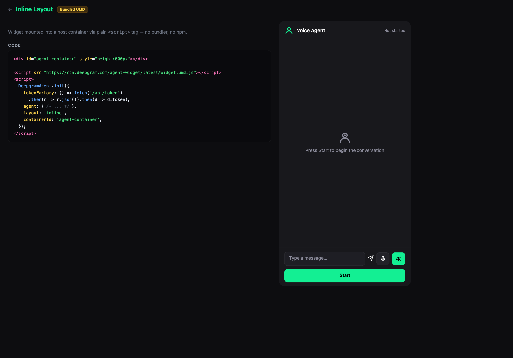

# Inline — Bundled UMD

CDN script tag, no build step. Agent panel mounted inline in a container. Uses `DeepgramAgent.init()` with `layout: 'inline'`.

**Package:** `@deepgram/agents-widget` (UMD bundle)



## Run

```bash
# From the repo root — build the UMD bundle first
bun run --filter '@deepgram/agents-widget' build
bun run dev:examples
# Open http://localhost:5173/21-umd-inline/
```
