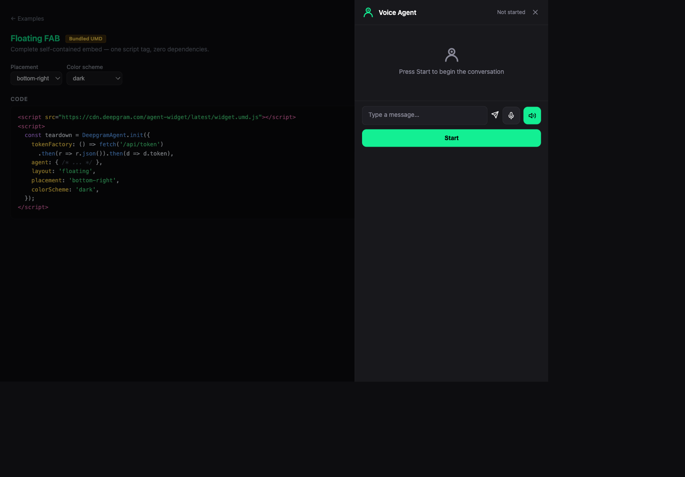

# Floating FAB — Bundled UMD

Self-hosted UMD bundle. Floating action button reveals an overlay panel. Uses `DeepgramAgent.init()` with `layout: 'floating'`.

**Package:** `@deepgram/agents-widget` (UMD bundle)



## Run

```bash
# From the repo root — build the UMD bundle first
bun run --filter '@deepgram/agents-widget' build
bun run dev:examples
# Open http://localhost:5173/22-umd-floating/
```
