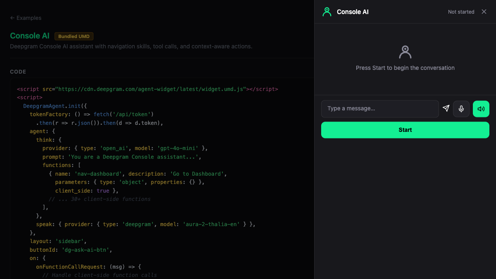

# Console AI — Bundled UMD

Deepgram Console AI assistant with navigation skills, tool calls, and context-aware actions. Demonstrates client-side function calls with the widget.

**Package:** `@deepgram/agents-widget` (UMD bundle)



## Run

```bash
# From the repo root — build the UMD bundle first
bun run --filter '@deepgram/agents-widget' build
bun run dev:examples
# Open http://localhost:5173/23-umd-console/
```
